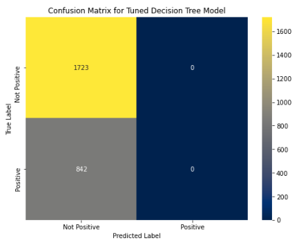

# Business Understanding

KBO Marketing Company LLC is a marketing firm.  The firm wants to develop a Natural Language Processing (NLP) model that can predict sentiment for technology products such as smartphones.

The company's C-suite executives request their in-house data scientists to develop a prototype.  For the prototype, the in-house data scientists will perform the following:

- Leverage tweets for the Apple and Google brand and its respective products
- Classify sentiment analysis into two groups: *Not Positive* and *Positive*

# Data Understanding

The data for examing the aforementioned problem comes from the following source: [Brands and Product Emotions](https://data.world/crowdflower/brands-and-product-emotions) 

Before beginning to create a model, I want to examine and become familiar with the dataset. I will conduct exploratory data analysis in order to understand the dataset attributes, which includes, but not limited to the following:

1. Number of Columns
2. Number of Rows
3. Column Names
4. Format of the data in each column

## Data Overview

I created a Pandas DataFrame from the csv file.  The DataFrame contains 8,721 rows of data.  The DataFrame contains the following columns:

- *df['tweet_text']* - this is the sentiment provided via tweet
- *df['emotion_in_tweet_is_directed_at']* - this is the brand, or product, in which the tweet is targeted
- *df['is_there_an_emotion_directed_at_a_brand_or_product']* - this is the emotional category of the tweet

All of the columns are in string format.

## Observations | Brand or Product

I utilized the following code - *df['emotion_in_tweet_is_directed_at'].value_counts()* - to understand the different brands and products that are captured by the respective column.  The different brands and products are the following: 

- *iPad*
- *Apple*
- *iPad or iPhone App*
- *Google*
- *iPhone*
- *Other Google product or service*
- *Android App*
- *Android*
- *Other Apple product or service*

A bar chart that breaks down the different brands and products is listed below.

## Observations | Brand or Product Sentiment

I utilized the following code - *df['is_there_an_emotion_directed_at_a_brand_or_product'].value_counts()* - to understand the brand and product sentiment captured by the respective column.  There are a total of four different brand and product sentiments, which are the following:

- *No emotion toward brand or product*
- *Positive emotion*
- *Negative emotion*
- *I can't tell* 

## Observations | Missing Values

I utilized the following code - *df.isna().sum()* - to understand how many missing values are within each column.  There is a total of 5,552 missing values in the *df['emotion_in_tweet_is_directed_at']* column.

There is 1 missing value in the *df['tweet_text']* column.

The other column *df['is_there_an_emotion_directed_at_a_brand_or_product']* did not have any missing values.

## Observations | Duplicate Rows

I utilized the following code - *df.duplicated().sum()* - to understand how many duplicates are present in the dataset.  There is a total of 22 duplicate rows.

# Data Preparation

The Data Understanding stage is complete.  Based on the exploratory data analysis, I will perform the following:

1. Remove duplicate rows
2. Remove observation that has a missing value in the *df['tweet_text']* column
3. Drop the column *df['emotion_in_tweet_is_directed_at']* from the Dataframe
4. Classify the brand or product sentiment into the two following categories - 1) Not Positive, or 2) Positive - via *df['is_there_an_emotion_directed_at_a_brand_or_product']* column 

## Remove Duplicate Rows

I utilied the following code - *df.drop_duplicates(inplace=True)* - to remove the duplicates from the DataFrame.  The number of rows is now 8,699.

## Remove Observation with Missing Tweet

I utilied the following code - *df.dropna(subset=['tweet_text'], axis=0, inplace=True)* - to remove the observation with the missing tweet from the DataFrame.  The aforementioned observation has been removed.  The number of rows is now 8,698.

## Remove the brand and product column

I utilied the following code - *df.drop('emotion_in_tweet_is_directed_at', axis=1, inplace=True)* - to remove the brand and product column.  The aforementioned column has been removed.

## Classify the brand or product sentiment

I have reclassified all of the brand and product sentiment into the two following categories - 1) Not Positive, or 2) Positive by performing the following:

- Removing the brand and product sentiment observations that was listed as "I can't tell" (this was 151 rows)
- Reclassifying the brand and product sentiment observations from "Positive emotion" into "Positive" (this was 2,861 rows)
- Reclassifying the brand and product sentiment observations from "No emotion toward brand or product" into "Not Positive" (this was 5,142 rows)
- Reclassifying the brand product sentiment observations from "Negative emotion" into "Not Positive" (this was 544 rows)

A bar chart that provides a breakdown of the new brand and product sentiment is listed below.

# Modeling

The Data Understanding phase is complete.  I will transition to creating two types of sentiment analysis models - Naive Bayes and Decision Tree.

## Pre-Processing

Before I create any type of sentiment analysis model, I will need to perform natural language pre-processing.  Natural language pre-processing entails the following:

- Tokenization
- Removing capitlization
- Removing punctuation
- Removing stopwords
- Stemming

### Enhancing Stopwords List

I enhanced the stopwords list in order to remove words and phrases that do not provide insight to how an individual feels about a brand or product.  The additional words and the reasons for adding them to the stopwords list are the following:

- *sxsw* - this is a reference to the South by Southwest music festival
- *mention* - this word is used to retweet another individual's tweet
- *rt* - this is an abbreviation that represents retweet
- *austin* - this is the city in which South by Southwest takes place
- *quot* - this phrase references a quotation
- *amp* - this phrase references the ampersand sign
- *link* - this word references hyperlink

I created a function for performing the natural language pre-processing.  I performed a test run of the aforementioned function on the following text, *I study at the Flatiron School; I am concentrating in Data Science.  I started in 2024.*.  The output of the natural language pre-processing functions are the following stemmed tokens:

- *studi*
- *flatiron*
- *school*
- *concentr*
- *data*
- *scienc*
- *start*

The stemmed tokens are the expected output.  I will proceed with performing a train-test split, and applying the natural language pre-processing function to the X-train and X-test.

## Naive Bayes

Natural language pre-processing of the tweets is complete.  I will transition towards performing the following:

- Vectorizing the data via Term Frequency-Inverse Document Frequency, or TF-IDF
- Creaing a Baseline Naive Bayes model

### Baseline Naive Bayes Model

### Baseline Naive Bayes Model | Conclusion

I have concluded creating a baseline Naive Bayes Model.

When the baseline model utilizes the training data, the evaluation metrics are the following:

- Precision: 94.0%
- Recall: 41.0%
- Accuracy: 79.2%
- F1 Score: 57.1%

When the baseline model utilizes the test data, the evaluation metrics are the following:

- Precision: 70.8%
- Recall: 20.2%
- Accuracy: 71.1%
- F1 Score: 31.4%

This is the initial model for product sentiment analysis.  There is clearly overfitting since the evaluation metrics for the training data are better than the evaluation metrics for the test data.

I also want to point out that precision will be the key evaluation metric.

Accuracy is not appropriate since there is a class imbalance in the population.  It is ideal to improve recall.  However, a false negative is not negatively impactful for a company.  In other words, a false negative states the model identified a customer that provided a *Not Positive* brand or product review.  However, in reality, the customer provided a positive review.

A false positive is more harmful for the brand or product than a false negative.  A false positive states the model identified a customer that provided a *Positive* review.  However, in reality, the customer provide a *Not Positive* review.  In this case, any company does not have the opportunity to intervene and remediate the issue, or issues, that the client has experienced.

As a result, precision is the key evaluation metric.

### Tuning the Baseline Naive Bayes Model

The Baseline Naive Bayes Model has a precision score of approximately 70.8%.  I want to determine whether or not I can tune the model by varying the TF-IDF minimum depth and maximum depth.

I will utilize a pipeline and Grid Search CV to tune the Naive Bayes model.

I have created the pipeline and grid search object.  When I utilized the following code - *grid_mnb_tune.best_params_* - the optimal values are the following:

**TF-IDF Vectorizer**

- max_df: 1.0
- min_df: 0.0

A maximum df of 1 means that the vectorizer is ignoring terms that appear in more than 100% of documents.  This is already the default setting of the TF-IDF vectorizer.

A minimum df of 0.0 means that the vectorizer is not ignoring any terms based on document frequency.

The default setting of the TF-IDF vectorizer minimum df is 1.  A minimum df of 1 means that the vectorizer is including all documents that appear in at least one document.

As a result, a TF-IDF min_df that is equal to 0.0 is not necessarily the same as a TF-IDF min_df that is equal to 1, or the default setting.

### Tuned Naive Bayes Model | Conclusion

I have completed tuning the Naive Bayes Model.  Evaluation Metrics are below.

**Baseline Naive Bayes Model**

When the baseline model utilizes the training data, the evaluation metrics are the following:

- Precision: 94.0%
- Recall: 41.0%
- Accuracy: 79.2%
- F1 Score: 57.1%

When the baseline model utilizes the test data, the evaluation metrics are the following:

- Precision: 70.8%
- Recall: 20.2%
- Accuracy: 71.1%
- F1 Score: 31.4%

**Tuned Naive Bayes Model**

When the tuned model utilizes the training data, the evaluation metrics are the following:

- Precision: 94.0% 
- Recall: 41.0%
- Accuracy: 79.2%
- F1 Score: 57.1%

When the baseline model utilizes the test data, the evaluation metrics are the following:

- Precision: 70.8%
- Recall: 20.2%
- Accuracy: 71.1%
- F1 Score: 31.4%

**Conclusions**

The evaluation metrics for the Tuned Naive Bayes model are the same as the Baseline Naive Bayes model.  There was no benefit in attempting to tune the Baseline Naive Bayes model based on the grid search object I created.

I will continue to use the Baseline Naive Bayes model.

## Decision Tree

I have already created a Naive Bayes model to predict customer sentiment analysis.

I am going to explore a different model - a decision tree classifier - to determine whether or not I can predict customer sentiment analysis.

### Baselilne Decision Tree Model

I will start the modeling process by creating a baseline decision tree classifier. I will create the model via ID3 (Iterative Dichotomiser 3).

Afterwards, I will determine whether or not I can improve the classifier by tuning the model performance.

### Baseline Decision Tree Model | Conclusion

I have concluded creating the Baseline Decision Tree Model.

When the baseline model utilizes the training data, the evaluation metrics are the following:

- Precision: 99.2%
- Recall: 91.1%
- Accuracy: 96.7%
- F1 Score: 95.0%

When the baseline model utilizes the test data, the evaluation metrics are the following:

- Precision: 54.2%
- Recall: 49.3%
- Accuracy: 69.7%
- F1 Score: 51.6%

There is overfitting with this model, which is common with decision tree models.  All of the evaluation metrics - precision, recall, accuracy, and F1 score - are above 90% when the training data is utilized.  However, when the test data is utilized, the evaluation metrics range between 40% and 70%.

I will proceed to tune the decision tree classifier.

### Tuned Decision Tree Model

There are multiple variables in which I want to tune the decision tree classifier.  I will currently focus on the following:
    
- Maximum Tree Depth (max_depth) - depth of the decision tree, the maximum number of splits a decision tree can have before continue to grow
- Minimum Sample Split (min_samples_split) - minimum number of samples required to split an internal node
- Minimum Sample Leafs (min_samples_leaf) - minimum number of samples required for a leaf node, or terminal node

**Maximum Tree Depth**

The optimal tree depth is approximately 2. After a tree depth of approximately 2, the AUC scores for the train and test data begin to bifurcate.

**Minimum Sample Split**

The optimal minimum sample split is approximately 0.7.  The AUC scores associated with the training data and test data remain converged after a minimum sample split of 0.7; however, the AUC scores also decrease.

**Minimum Sample Leafs**

The optimum minimum sample leaf is approximately 0.2.  The AUC scores associated with the training data and test data remain converged after a minimum sample leaf of 0.2; however, the AUC scores also decrease.

I have found the approximate optimal values for Maximum Tree Depth, Minimum Sample Split, and Minimum Sample Leafs.  I will create a pipeline and grid search cv that will not only incorporate the aforementioned values, but vary the TF-IDF minimum depth, TF-IDF maximum depth, Decision Tree model criterion, and Decision Tree class weight.

I have created the pipeline and grid search object.  When I utilized the following code - *grid_clf_tune.best_params_* - the optimal values are the following:

**TF-IDF Vectorizer**

- max_df: 1.0
- min_df: 0.0

**Decision Tree**

- criterion: entropy
- max_depth: 1
- min_samples_leaf: 0.15
- min_samples_split: 0.6
- class weight: None

### Tuned Decision Tree Model | Conclusion

I have completed tuning the Decision Tree Model.  Evaluation Metrics are below.

**Baseline Decision Tree Model**

When the baseline model utilizes the training data, the evaluation metrics are the following:

- Precision: 99.2% 
- Recall: 91.1%
- Accuracy: 96.7%
- F1 Score: 95.0%

When the baseline model utilizes the test data, the evaluation metrics are the following:

- Precision: 54.2%
- Recall: 48.0%
- Accuracy: 69.6%
- F1 Score: 50.9%

**Tuned Decision Tree Model**

When the tuned model utilizes the training data, the evaluation metrics are the following:

- Precision: 0.00% 
- Recall: 0.00%
- Accuracy: 66.2%
- F1 Score: 0.00%

When the baseline model utilizes the test data, the evaluation metrics are the following:

- Precision: 0.00%
- Recall: 0.00%
- Accuracy: 67.2%
- F1 Score: 0.00%

**Conclusions**

The Baseline Decision Tree Model clearly outperforms the Tuned Decision Tree Model.  

The most peculiar observation is that the majority of the training and test evaluation metrics - precision, recall, and F1 score - are zero percent.  Reasons for this peculiar observation are the following:

- Grid Search: Tuning the Decision Tree parameters such as *max_depth*, *min_samples_split*, and * min_samples_leaf* may have created a Decision Tree model that is too complex or too simple.

- Paramter Grid: The overall grid may not be optimal for the given dataset.

# Overall Conclusion and Recommendations

## Overall Conclusion and Recommendations

Precision scores for all of the models are the following:

- Baseline Naive Bayes Model (70.8%)
- Tuned Naive Bayes Model (70.8%)
- Baseline Decision Tree Model (54.2%)
- Tuned Decision Tree Model (0.0%)

The Baseline Naive Bayes Model performed the best in comparison to the Baseline Decision Tree Model and the Tuned Decision Tree Model.  The Baseline Naive Bayes Model has the same precision score as the Tuned Naive Bayes Model.  However, I chose the Baseline Naive Bayes Model over the Tuned Naive Bayes Model because it was constructed without updating any parameters.

There are limitations to the the Baseline Naive Bayes Model.  It was constructed based on 8,547 tweets.  Additional data needs to be collected in order to train and test the aforementioned model.

## Next Steps

The next step is to refine the NLP model via additional data.

The following are potential data sources:
    
**1. Public Online Communities**

X, or formerly Twitter, is not the only public online community.  There are other public online communities - for example, Instagram and Reddit - in which brand or product feedback can be gathered for sentiment analysis.

**2. Other Smartphone Companies**

Apple and Google command the most brand equity in regards to smartphones and related products.  However, they are not the only companies with this offering.  Motorola and Nokia offer smartphones in the marketplace.

**3. Private Online Communities**

The general populace is familiar with public online communities such as X, Instagram, and Reddit.  However, there are also private communities in which companies offer individuals access to membershp forums.  And the same companies monitor feedback in regards to the respective company and/or product.

# References

1. 
2. 
3. 